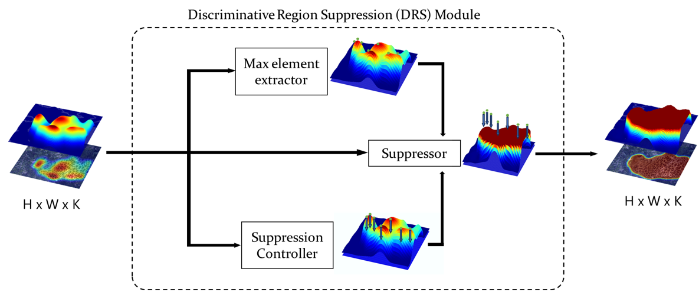
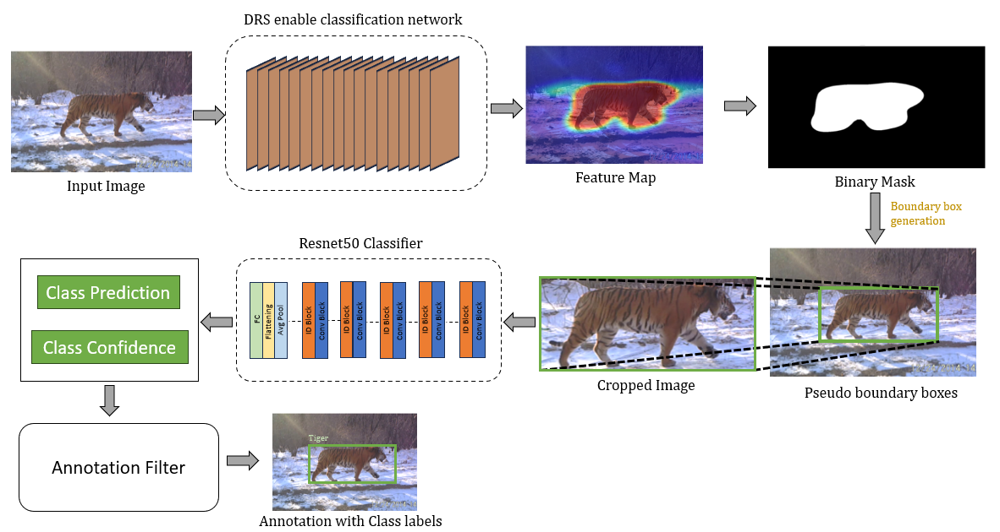
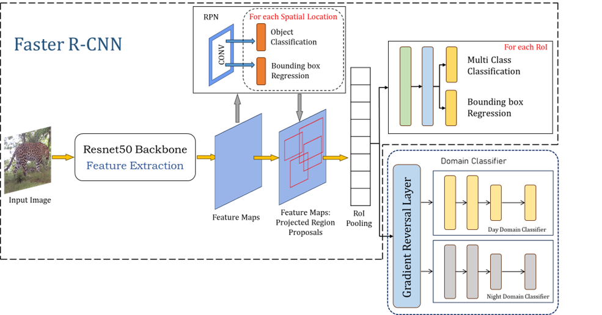

# Animal Trespassing Detection using Weak Supervision and Debiasing

This repository contains notebooks implementing a weakly supervised approach for detecting animal trespassing in agricultural and residential areas using CCTV images. The method overcomes the lack of bounding box annotations and class imbalance between day and night scenarios through a combination of Class Activation Maps (CAMs), a Discriminative Region Suppression (DRS) module, and adversarial domain debiasing.

## Repository Contents

> All implementation is in `.ipynb` format for better reproducibility and explanation of intermediate outputs.

## Concept Overview

The detection pipeline addresses the following problems:
- Lack of annotated bounding boxes in real-world surveillance datasets.
- Heavy bias toward daytime images causing poor performance on night images.
- Need for reliable object localization using weak supervision.

### Key Components

#### 1. Dataset Bias
Images captured via CCTV are predominantly from daytime, resulting in lighting-based domain imbalance. No bounding box annotations are provided.

#### 2. CAM + DRS Annotator
We use a VGG-based network with Discriminative Region Suppression (DRS) to expand the attention from highly discriminative parts to the full object extent.

##### DRS Module


##### Annotator Pipeline


#### 3. Pseudo Label Generation
Class Activation Maps are thresholded and converted into bounding boxes through connected component analysis. These serve as pseudo-annotations.

#### 4. Refinement with ResNet-50
Each pseudo-annotated region is passed through a ResNet-50 classifier. Only high-confidence, semantically correct regions are retained.

#### 5. Adversarial Debiasing
A Gradient Reversal Layer (GRL) and domain classifier are introduced into Faster R-CNN to learn domain-invariant features. This ensures that detection performance remains consistent across both day and night images.



KL Divergence is used to monitor prediction divergence across domains. Lower divergence after training confirms effective debiasing.

## Getting Started

Clone the repository:

```bash
git clone https://github.com/sri-sethu/Debiasing-Object-Detection-Model.git
cd Debiasing-Object-Detection-Model
```

Install Dependencies

```bash
pip install -r requirements.txt
```